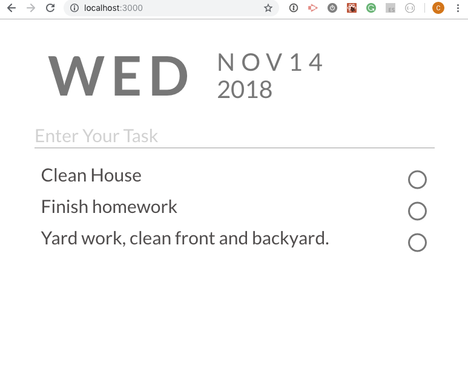

This app is ToList with multiple features.

1. Todo shows Date on the top. 'moment.js'
2. Open up another client screen. Adding todo is synced up on all client screens.
3. Click on circle is marked as done and changes to crossed circle. Click on the crossed circle to delete it.
4. Todo text and complete is stored in MongoDB.

Frontend side is written in React.
Backend side is written in Node/Express.
DB is MySQL with Sequelize.js
